# ESP32 HamClock

A **TFT-based ham radio clock & propagation dashboard** for the ESP32.  
It shows **local and UTC time**, **HF/VHF band conditions**, **solar/geomagnetic data**, and **weather info** on a touch-enabled screen.

---

## ✨ Features
- 📺 **TFT Display** — ILI9341 / ILI9488 via **TFT_eSPI** (fast sprites, broad controller support).  
- ⏰ **Four clock faces on one page** — Dual QTH+UTC, seven segment, analogue dial, or binary (BCD), switchable on the Clock page.  
- 🌤️ **Weather** — [Open-Meteo](https://open-meteo.com); no account or API key needed.  
- 🌦️ **Weather page** — Dedicated display page with temperature, daily range, wind, pressure, sunrise/sunset.
- ☀️ **Solar & HF propagation** — Data from [hamqsl.com](https://www.hamqsl.com/).  
- 📡 **Band condition indicators** — Good / Fair / Poor at a glance.  
- 📶 **Easy Wi-Fi setup** — Captive portal AP **`HB9IIUSetup`** on first boot.  
- 🌐 **Web interface** — One page per screen: General (position, callsign, brightness, splash logo, screensaver), Clock, Weather, Satellites, DX Cluster, WiFi.  
- 🛰️ **Satellite passes** — Track satellites by NORAD id; next passes plus a live "above the horizon now" indicator.
- ☀️ **Sun & moon** — Positions, rise and set, moon phase and illumination, grey-line indicator. Computed on the device, no network needed.
- 📻 **NCDXF/IARU beacons** — Which beacon is transmitting on each band right now, with frequencies. Also purely computed.
- 🌍 **DX cluster** — Live spots from a telnet cluster node, filtered by band, mode and continent (Europe) from the screen or the web UI.
- 🔆 **Brightness control** — Backlight dimming from the General page.
- 💤 **Screensaver mode** — Random pixel animation.  
- 💾 **Persistent settings** — Stored as JSON in SPIFFS.  
- 🔗 **mDNS** — Reach the clock at **`http://hamclock.local`** instead of hunting for its IP.  

---

## 📦 Requirements
- ESP32 (ESP32-S3 recommended for TFT touch projects)  
- TFT compatible with **TFT_eSPI** (ILI9341/ILI9488)  
- PlatformIO or Arduino IDE  

---

## 🚀 Quick Start

1. Clone the repo and open with **PlatformIO** (or Arduino IDE).  
2. Configure **TFT_eSPI** for your panel (ILI9341/ILI9488).  
3. Build & upload firmware to the ESP32.  

---

## ⚙️ First-time Setup
1. **Power on** the device. It starts an AP called **`HB9IIUSetup`**.  
2. **Connect** to the AP and open `192.168.4.1` to enter your Wi-Fi credentials.  
3. After joining your network, access **`http://hamclock.local`**.  
4. In the web UI, set your **position and callsign** on the General page, pick a clock face and its colors on the Clock page, and (optionally) **upload a custom splash** image. Weather needs no key.  
5. Done — the clock/propagation panels will update automatically.  

---

## 🛰️ Satellite Passes

A dedicated display page (touch through to page 7) lists the next passes over your
configured location and highlights any satellite that is above the horizon right now.

1. Open **`http://hamclock.local/sat.html`** (also linked from the navigation bar on every settings page).
2. Enter the **NORAD catalogue numbers** you want to follow — the ISS is `25544`.
   Up to 8 satellites are supported. Preset buttons cover the common ham and weather birds.
3. Set the minimum elevation, how many passes to show, and the prediction horizon.

Element sets are downloaded from [Celestrak](https://celestrak.org), cached in SPIFFS and
refreshed every 12 hours by default, so predictions survive a reboot and a short outage.
All orbital mechanics run on the ESP32 — no API key and no per-pass network call.

**On the display:** a green banner means the satellite is above your minimum elevation
and workable right now. Rows in the pass table turn yellow within ten minutes of AOS.

**Limitation:** only near-earth objects are supported (orbital period under 225 minutes).
Geostationary and Molniya satellites need the deep-space SDP4 model, which this firmware
does not implement — such an id is reported as unsupported rather than silently mispredicted.

---

## 🖼️ Screens

Every frame below is read straight off the panel through the device's own
`/screenshot` endpoint, so these are the display's actual memory at 320x240 -
not mock-ups. Pages are reached by tapping the right half of the screen to go
forward and the left half to go back.

### Clock

<table>
<tr>
<td align="center" width="33%">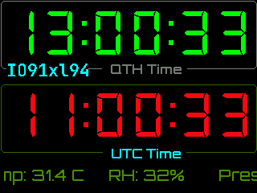 Page 1 - local and UTC time together, with the Maidenhead locator on the QTH caption</td>
<td align="center" width="33%">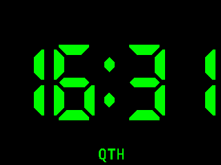 Page 1 - full screen clock, seven segment</td>
<td align="center" width="33%">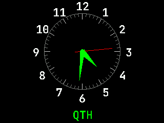 Page 1 - the same clock as an analogue dial</td>
</tr>
<tr>
<td align="center" width="33%">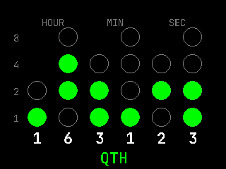 Page 1 - and as a binary (BCD) clock</td>
<td colspan="2" valign="top">

Page 1 has four faces, chosen on the <b>Clock</b> page of the web UI: the dual
QTH+UTC display, or one of three full-screen single-time clocks. On the three
single-time faces, the badge underneath switches the clock between <b>QTH</b>
and <b>UTC</b> time when tapped; the dual face already shows both, so it has no
badge.

The binary clock reads bottom-up, one column per decimal digit, hours through
seconds; the bit weights run down the left edge and the decimal value is printed
under each column.

</td>
</tr>
</table>

### Propagation and space weather

<table>
<tr>
<td align="center" width="33%">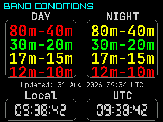 Page 2 - day and night band conditions</td>
<td align="center" width="33%">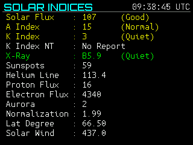 Page 3 - solar flux, sunspots, X-ray and wind</td>
<td align="center" width="33%">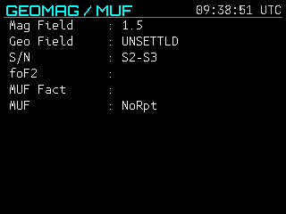 Page 4 - geomagnetic field and MUF</td>
</tr>
<tr>
<td align="center" width="33%">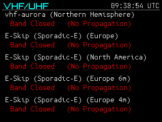 Page 5 - aurora and sporadic-E openings</td>
<td align="center" width="33%">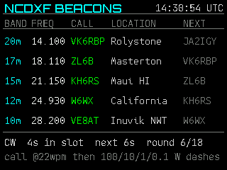 Page 9 - NCDXF/IARU beacon tracker, computed from the clock alone</td>
<td align="center" width="33%">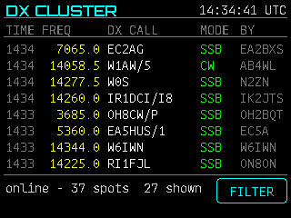 Page 11 - live DX cluster spots, filtered by band, mode and continent</td>
</tr>
</table>

The beacon page needs no network at all: the eighteen NCDXF beacons keep a
strictly timed three-minute round anchored to 00:00:00 UTC, so accurate time and
a table are the whole mechanism. The <b>FILTER</b> button on the DX page opens a
touch panel of band, mode and continent chips.

### Sky, weather and status

<table>
<tr>
<td align="center" width="33%">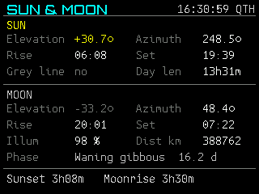 Page 10 - sun and moon positions, rise and set, phase and grey line</td>
<td align="center" width="33%">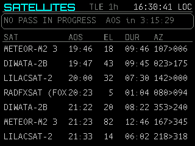 Page 7 - upcoming satellite passes for the configured QTH</td>
<td align="center" width="33%">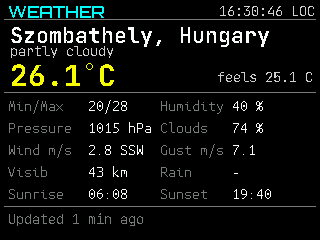 Page 8 - current conditions from Open-Meteo</td>
</tr>
<tr>
<td align="center" width="33%">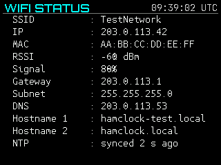 Page 6 - Wi-Fi link quality, addresses and NTP state</td>
<td colspan="2" valign="top">

The sun and moon page is computed on the device from the QTH and the time, so it
keeps working with no network. Its rise and set times are for the local calendar
day, the window almanacs use, which is why today's sunset stays on screen after
it has passed rather than jumping to tomorrow's.

</td>
</tr>
</table>

---

## 🔧 Configuration Tips
- **Display type**: Ensure your **TFT_eSPI** `User_Setup` matches your panel (ILI9341/ILI9488).  
- **Weather**: Nothing to configure beyond your position — Open-Meteo needs no key. The refresh interval is set on the Weather page.  
- **DX cluster**: A cluster login identifies you on a shared network, so enter **your own callsign** on the General or DX Cluster page. Nothing connects until you do. The continent filter is best-effort (a callsign-prefix table), not a precise DXCC lookup.  
- **Band indicators**: Values are derived from hamqsl.com solar/geomagnetic data fetched by the device.  
- **Splash screen**: Upload a PNG via the General page; it’s stored in SPIFFS along with your settings.  

---

## 🙌 Credits / Inspiration
This project was inspired by the excellent work of **SQ9ZAQ**:  
- **HamQSL XML Parser** — https://github.com/canislupus11/HamQSL-XML-Parser  

Thanks for the idea and the initial approach to parsing and displaying **hamqsl.com** propagation data on small TFTs.  
This project is a ground-up implementation for ESP32 with **TFT_eSPI**, a web-configurable UI, and captive portal onboarding.  
No source code from the above project is copied into this repository. (Attribution provided as inspiration.)  

---

## 📝 To-Do
- 📱 Improve web UI layout for **mobile** screens.  

---

## 🧩 Troubleshooting
- **I don’t see the portal `HB9IIUSetup`** — Power cycle; ensure the board isn’t already configured to join your Wi-Fi.  
- **`hamclock.local` doesn’t resolve** — Try the device’s IP from your router; ensure mDNS is supported on your OS/network.  
- **Blank/garbled display** — Reconfirm your **TFT_eSPI** configuration (pins, controller type).  
- **Weather not showing** — Check network connectivity and the position set on the General page.  
- **No DX spots** — Check the callsign on the DX Cluster page; the serial log echoes the first lines of each cluster session.  

---

## 📜 License

This project is licensed under the  
**Creative Commons Attribution-NonCommercial-ShareAlike 4.0 International (CC BY-NC-SA 4.0)** license.  

- ✅ You are free to use, modify, and share this work.  
- ✅ You must give **appropriate credit** (attribution).  
- ✅ You must share any derivative works under the **same license**.  
- ❌ You may **not use this work for commercial purposes** (e.g., selling preloaded hardware, reselling code, or monetizing it in any way).  

Full license text: [CC BY-NC-SA 4.0](https://creativecommons.org/licenses/by-nc-sa/4.0/)    
